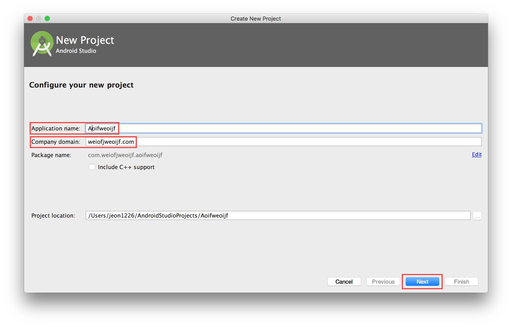
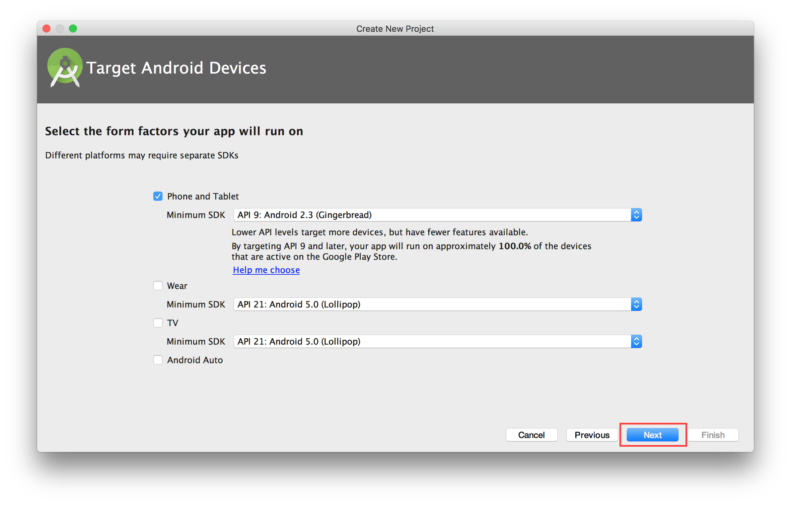
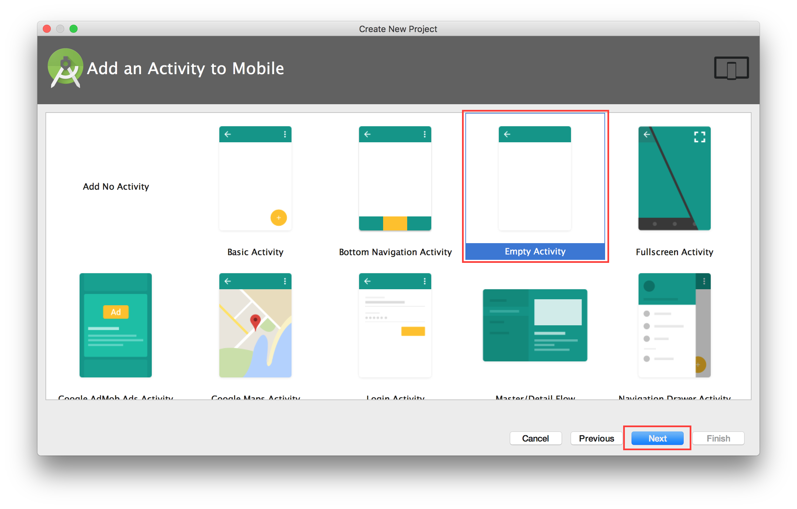
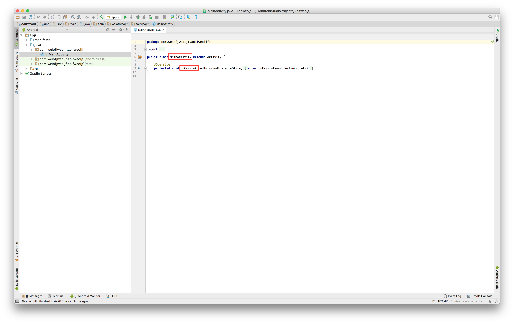

# How to Make Template?

Start by making an empty apk which contains both the `MainActivity` and `onCreate()` methods. Anything other than these methods could cause a malicious signature and impact the results, so we shouldn't include any layout, library, icon, image, etc.

Start a new project.


Start by putting some random names in the `Application name` and `Company domain` boxes. If you send this empty apk to VirusTotal frequently (with some malicious features injected to it) it is likely that your application name and company domain will be registered as malicious signatures by AV companies. To avoid this, you should create a new empty apk's with different application names and company domains after several queries to VirusTotal.



Pick a Minimum SDK. (It is not likely to impact the result.



Choose `Empty Activity`.



`Activity name` must be `MainActivity`. You do not need to generate Layout File. Also, you do not need to support Backwards Compat. Layout and Backward Compat library increase the size of your empty apk. It looks like these basic libraries and layouts included in an empty apk do not affect the results, but we are not sure about it.


There must be ```onCreate()``` method in you ```MainActivity```.



Now you can build it with or without ```ProGuard```.


